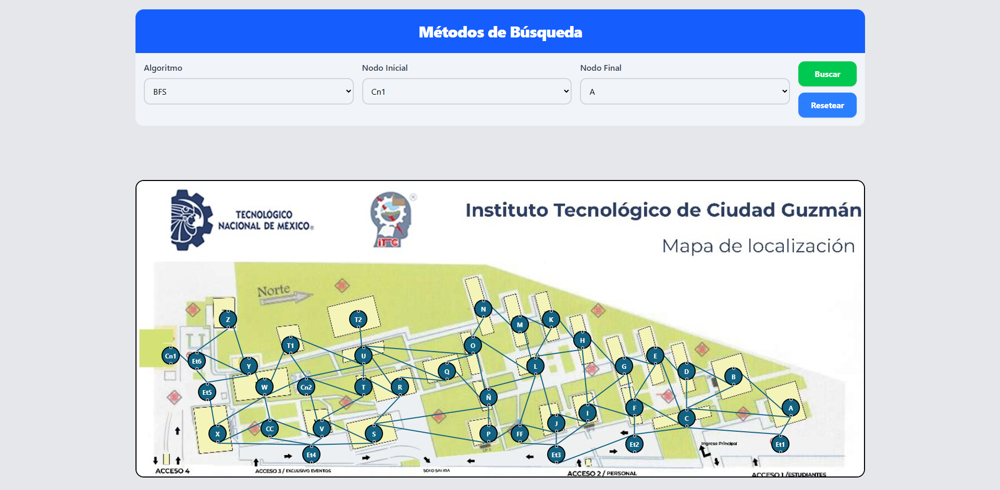

# Metodos de Busqeuda - FrontEnd

Antes de comenzar, asegúrate de tener instalado lo siguiente:

-   [Node.js](https://nodejs.org/) (versión 18.x o superior)
-   [npm](https://www.npmjs.com/) (incluido con Node.js)

## Requisitos Previos

Antes de comenzar, asegúrate de tener instalado lo siguiente:

-   [Node.js](https://nodejs.org/) (versión 18.x o superior)
-   [npm](https://www.npmjs.com/) (incluido con Node.js)

## Instalación de Node.js

### Windows

1. Visita [nodejs.org](https://nodejs.org/)
2. Descarga el instalador para Windows
3. Ejecuta el instalador y sigue las instrucciones
4. Verifica la instalación abriendo la terminal y ejecutando:
    ```bash
    node --version
    npm --version
    ```

### macOS

1. Usa Homebrew:
    ```bash
    brew install node
    ```
2. O descarga el instalador de [nodejs.org](https://nodejs.org/)
3. Verifica la instalación:
    ```bash
    node --version
    npm --version
    ```

### Linux (Ubuntu/Debian)

```bash
# Actualiza los repositorios
sudo apt update

# Instala Node.js y npm
curl -fsSL https://deb.nodesource.com/setup_18.x | sudo -E bash -
sudo apt-get install -y nodejs

# Verifica la instalación
node --version
npm --version
```

## Configuración del Proyecto

Hay dos formas de configurar el proyecto:

### Opción 1: Clonar con Git

1. Clona el repositorio:
    ```bash
    git clone https://github.com/tu-usuario/tu-proyecto.git
    cd tu-proyecto
    ```

### Opción 2: Descargar ZIP

1. Visita la página del repositorio en GitHub
2. Haz clic en el botón verde "Code"
3. Selecciona "Download ZIP"
4. Extrae el archivo ZIP en tu computadora
5. Abre la terminal en la carpeta extraída

### Instalación de Dependencias

Una vez descargado el proyecto (por cualquiera de los métodos) y estando en la carpeta del proyecto, instala las dependencias:

```bash
npm install
```

## Iniciar Proyecto

En el directorio del proyecto una vez descargado las dependencias con el paso anterios ahora podras ejecutar el proeycto:

En la terminal del directorio del proyecto ejecuta el siguiente comando:

```bash
npm run dev
```

Debera cargar algo como lo siguiente, lo unico que debes de hacer es dar clic en el link de: http://localhost:5173/

```bash
      VITE v6.2.2  ready in 514 ms

    ➜  Local:   http://localhost:5173/
    ➜  Network: use --host to expose
    ➜  press h + enter to show help

```

La pagina luce asi:


## Configuración del servidor

Por ultimo tendras que activar el servidor de Django para obtener los datos, las instrucciones se encuentran en:
https://github.com/Fgvs11/MetodosBusquedaDjango
